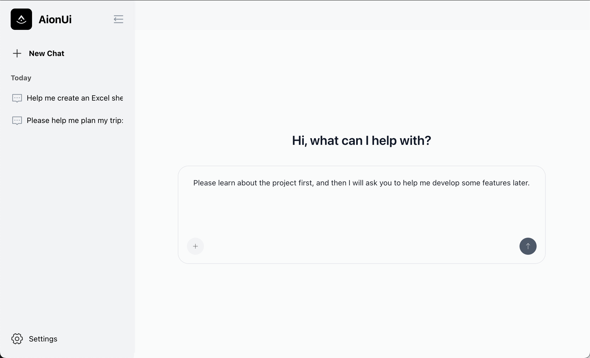

<p align="center">
  
</p>

<p align="center">
  
  &nbsp;
  
  &nbsp;
  
  &nbsp;
  
</p>


---
<p align="center">
  <strong>将命令行体验转换为现代、高效的 AI 聊天界面。</strong>
</p>

<p align="center">
  <a href="./readme.md">English</a> | <strong>简体中文</strong> | <a href="https://www.aionui.com" target="_blank">官网</a> | <a href="https://twitter.com/AionUI" target="_blank">Twitter</a>
</p>

<p align="center">
  <table align="center">
    <tr>
      <td style="border: 2px solid #6b7280; padding: 8px;">
        
      </td>
    </tr>
  </table>
</p>

## 📋 目录

- [🤔 为什么需要 AionUi？](#-为什么需要-aionui)
- [✨ 核心功能](#-核心功能)
  - [💬 增强的聊天体验](#-增强的聊天体验)
  - [🗂️ 文件与项目管理](#️-文件与项目管理)
  - [⚡ 开发者工作流](#-开发者工作流)
- [🚀 快速开始](#-快速开始)
  - [📥 下载](#-下载)
  - [📋 系统要求](#-系统要求)
  - [🔧 安装](#-安装)
  - [🏗️ 构建应用](#️-构建应用)
- [🛠️ 技术栈](#️-技术栈)
- [📁 项目结构](#-项目结构)
- [🎯 使用场景](#-使用场景)
- [🔧 配置](#-配置)
  - [🔑 API 配置](#-api-配置)
  - [🌐 代理配置](#-代理配置)
- [🚀 未来畅想](#-未来畅想)
  - [📍 现在在哪](#-现在在哪)
  - [🎯 要去哪里](#-要去哪里)
- [📄 许可证](#-许可证)
- [🤝 贡献](#-贡献)

---

## 🤔 为什么需要 AionUi？

虽然官方的 Gemini CLI 功能强大，但其命令行界面在日常使用中存在一些限制。AionUi 提供了一个 GUI 替代方案来解决这些关键痛点：

*   **文件管理：** 使用 `@` 命令管理代码上下文可能很繁琐
*   **聊天记录：** 关闭 CLI 窗口后对话就会丢失
*   **聊天体验：** 命令行界面缺乏自然的聊天交互
*   **多任务处理：** 单对话模型限制了并行工作流

AionUi 为需要更好工作流效率的开发者提供了现代界面。

## ✨ 核心功能

### 💬 **增强的聊天体验**
- **多会话管理** - 同时管理多个独立的聊天会话
- **持久化历史** - 所有对话本地保存，永不丢失工作内容
- **现代界面** - 自然的聊天 UI，熟悉的消息控件

### 🗂️ **文件与项目管理**
- **可视化文件树** - 浏览并选择文件，一键集成到聊天
- **文件上传** - 拖拽上传文件进行 AI 处理，安全的临时存储
- **代码差异视图** - 文件变更的并排对比

### ⚡ **开发者工作流**
- **函数调用** - 完整的 Gemini API 集成，支持高级功能
- **富文本渲染** - 代码块和格式化内容的精美渲染
- **简易设置** - 直接在界面中配置 API 密钥

## 🚀 快速开始

### 📥 下载

准备试用 AionUi？下载适合您平台的最新版本：

<p>
  <a href="https://github.com/office-sec/AionUi/releases/latest/download/AionUi-mac-arm64.dmg">
    
  </a>
  &nbsp;
  <a href="https://github.com/office-sec/AionUi/releases/latest/download/AionUi-win-x64.exe">
    
  </a>
</p>

<p>
  <em>其他平台或开发版本，请查看 <a href="https://github.com/office-sec/AionUi/releases">发布页面</a>。</em>
</p>

### 📋 系统要求

- Node.js >= 16.0.0
- npm >= 8.0.0
- Google Gemini API 密钥 ([获取您的 API 密钥](https://aistudio.google.com/app/apikey))

### 🔧 安装

1. **克隆仓库**

   ```bash
   git clone https://github.com/office-sec/AionUi.git
cd AionUi
   ```

2. **安装依赖**

   ```bash
   npm install
   ```

3. **配置 API 密钥**

   - 打开应用程序并进入设置
   - 输入您的 Google Gemini API 密钥
   - 支持多种认证方式：Gemini API 密钥、Vertex AI、个人认证

4. **启动应用程序**
   ```bash
   npm start
   ```

### 🏗️ 构建应用

```bash
# 构建 macOS 版本
npm run build-mac --arch=arm64  # Apple Silicon
npm run build-mac --arch=x64    # Intel

# 构建 Windows 版本
npm run build-win

# 构建所有平台
npm run build
```

## 🛠️ 技术栈

- **桌面应用**: Electron 37.2.0
- **前端框架**: React 19.1.0
- **UI 组件库**: Arco Design Web React
- **AI 引擎**: Google Gemini CLI Core
- **样式框架**: UnoCSS
- **构建工具**: Webpack + TypeScript
- **图标库**: IconPark React

## 📁 项目结构

```
AionUI/
├── src/
│   ├── adapter/          # 适配器层
│   ├── agent/           # AI 代理
│   │   └── gemini/      # Gemini AI 集成
│   ├── common/          # 通用模块
│   ├── process/         # 主进程
│   ├── renderer/        # 渲染进程
│   │   ├── components/  # UI 组件
│   │   ├── conversation/# 对话相关
│   │   └── messages/    # 消息处理
│   └── worker/          # 工作进程
├── config/              # 配置文件
├── public/              # 静态资源
└── package.json
```

## 🎯 使用场景

- **代码开发**: 代码审查、重构建议、错误修复
- **文档编写**: 自动文档生成、报告摘要
- **数据分析**: 数据可视化、分析报告
- **项目管理**: 任务规划、进度跟踪
- **学习助手**: 知识问答、概念解释

## 🔧 配置

### 🔑 API 配置

支持三种认证方式：

1. **Gemini API 密钥**: 直接使用 Gemini API
2. **Vertex AI**: 使用 Google Cloud Vertex AI
3. **个人认证**: OAuth 个人认证

### 🌐 代理配置

支持 HTTP 代理配置，适用于网络受限环境。

## 🚀 未来畅想

### 📍 现在在哪
AionUi 目前为 Gemini CLI 提供强大的 GUI 界面，提供增强的聊天体验、文件管理和开发者工作流优化。

### 🎯 要去哪里
我们设想 AionUi 将发展成为一个**通用智能体平台**，让普通用户也能使用强大的 AI 智能体来处理日常工作：

#### 🤖 **多智能体生态系统**
- **终端智能体**：从 Gemini CLI 开始，扩展到其他基于终端的智能体
- **浏览器智能体**：集成开源浏览器自动化智能体来处理网页任务
- **统一体验**：适用于所有智能体类型的简单聊天界面
- **智能体发现**：轻松访问新推出的智能体

#### 🔄 **灵活的 LLM 绑定**
- **多 LLM 支持**：将不同的语言模型（Gemini、Claude、GPT 等）绑定到任何智能体
- **模型切换**：轻松在不同 LLM 之间切换，而无需改变工作流
- **自定义配置**：为每个模型独立配置 API 密钥和设置

#### 🎯 **让 AI 智能体触手可及**
我们的目标是让强大的 AI 智能体为所有人所用，而不仅仅是开发者。我们相信：
- **复杂任务应该感觉简单**：用户不应该需要为不同的智能体学习不同的界面
- **AI 应该适应用户**：而不是相反
- **开源很重要**：我们优先集成开源智能体，确保透明度和社区控制
- **聊天是通用的**：简单的对话界面可以处理复杂的工作流

AionUi 旨在弥合强大 AI 能力与日常可用性之间的差距，让复杂的 AI 智能体像与朋友聊天一样简单易用。

---

## 📄 许可证

本项目采用 [Apache-2.0](LICENSE) 许可证。

## 🤝 贡献

欢迎提交 Issue 和 Pull Request！

1. Fork 本项目
2. 创建功能分支 (`git checkout -b feature/AmazingFeature`)
3. 提交更改 (`git commit -m 'Add some AmazingFeature'`)
4. 推送到分支 (`git push origin feature/AmazingFeature`)
5. 打开 Pull Request

---

<div align="center">

**⭐ 如果喜欢就给我们一个星吧**

[报告 Bug](https://github.com/office-sec/AionUi/issues) · [创建功能请求](https://github.com/office-sec/AionUi/issues)

</div>